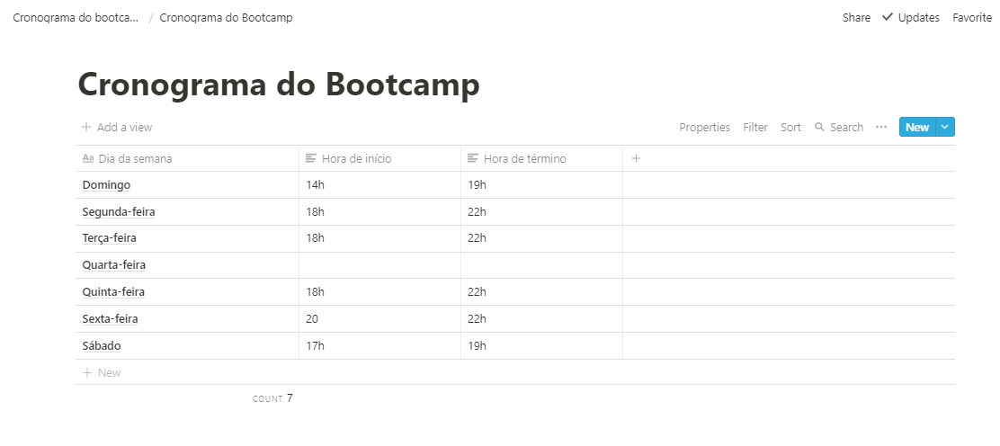
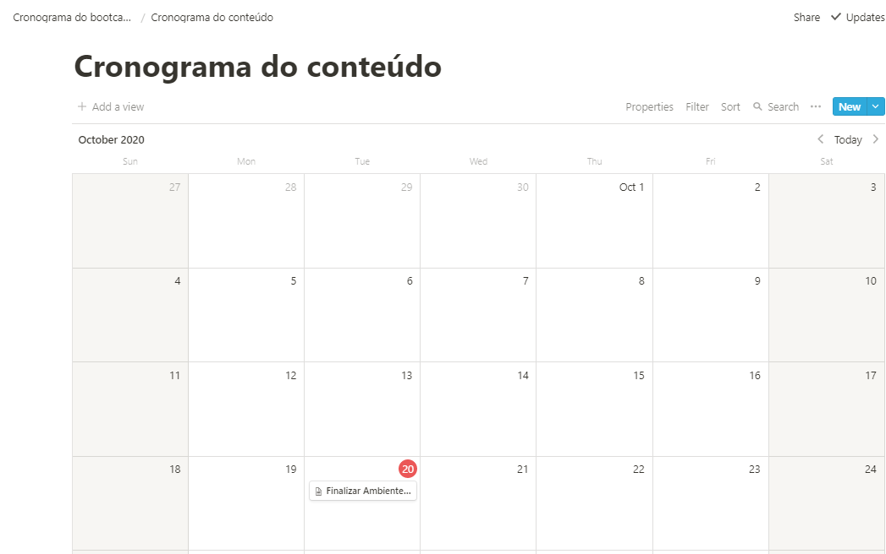

<h3 align="center"> Desafio 1: Planejando meus estudos</h3>

# :rocket:  Sobre o desafio

Nesse desafio, você deve planejar os seus estudos.

Para isso, você deve criar um cronograma que irá se adaptar ao seu tempo e ritmo.

Defina qual será seu horário de estudo, criando tarefas que estarão atreladas a um calendário, para se manter com foco e sempre alinhado com seus objetivos!

## Definindo o cronograma semanal

Horários fixos definidos para dedicar durante a jornada como programador, afinal, a rotina de estudos será o primeiro passo para atingir os meus objetivos o mais rápido possível!

## Definindo o cronograma diário

Definindo as metas diárias a ser feitas.
